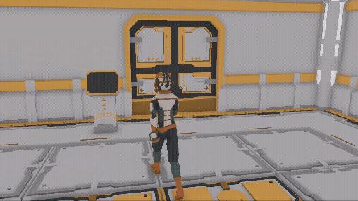

# Third-Person Interaction System (Unity)

This repository contains a **Third-Person Interaction System** built with Unity. It demonstrates how to implement player interactions with world objects in a third-person view using clean, modular code. The system is designed for reusability and scalability, making it ideal for RPGs, adventure games, and other interaction-heavy projects.

## Gameplay



## Overview

This project showcases:
- A third-person camera system with player-controlled rotation.
- A modular interaction framework using interfaces and ScriptableObject event channels.
- Interactable world objects (like chests, doors, and NPCs) with visual feedback and UI prompts.
- Input handling powered by Unity’s **New Input System**.
- A clean separation between gameplay logic, input, and UI for maintainability.

## Key Features

### 1. Third-Person Camera & Movement
- **CameraThirdPersonLook**: Handles smooth camera rotation based on player input using Cinemachine virtual cameras.
- **PlayerController**: Provides simplified walking movement and smooth rotation aligned with input direction.
- **MovementAnimationEventTrigger**: Plays footstep and landing sounds triggered by animation events.

### 2. Modular Interaction System
- **IInteractable** interface defines a consistent contract for all interactable objects:
  - `UIAnchor` for positioning the interaction UI.
  - `CanInteract` to determine if the object can currently be interacted with.
  - `InteractionTypeName` to display context-specific prompts (e.g., “Open”, “Talk”).
  - `Interact()`, `OnFocusGained()`, `OnFocusLost()` to manage interaction behavior.

- **Interactable**: Base implementation of `IInteractable` with outline highlights to indicate focus.

- **Interactor**: Detects nearby interactables via an overlap sphere, raises events when objects are focused/unfocused, and invokes their `Interact()` method on input.

### 3. Event-Driven Architecture
- ScriptableObject event channels decouple systems:
  - **IInteractableEventChannelSO**: Broadcasts interactable events.
  - **InteractableHoverUIEventChannelSO**: Notifies UI when an interactable is hovered.
  - **VoidEventChannelSO**: Used for events without parameters.

This pattern ensures UI, input, and gameplay systems communicate without direct dependencies.

### 4. Interaction UI
- **UIInteraction**: Displays and hides a floating UI prompt when the player approaches interactable objects. The UI text updates dynamically based on `InteractionTypeName`.
- **Billboard**: Keeps UI elements facing the main camera at all times.

### 5. Example Interactable Objects
The project includes several example interactables to demonstrate different behaviors:
- **Chest**: Opens the lid using DOTween animation on interaction.
- **Door & DoorComputer**: Toggles sliding doors open/closed via an interactable computer terminal.
- **Suitedman (NPC)**: Plays an animation and displays a chat bubble when interacted with.

These examples show how easily new interactable types can be added using the system.

### 6. Input Handling
- **InputReader**: A ScriptableObject wrapper around the generated `GameInput` class, providing:
  - Movement, sprint, jump, and interaction input events.
  - Decoupled input logic from gameplay components.
- Uses Unity’s **New Input System** action maps for flexible input bindings across devices.

## How It Works

1. **Detection**: `Interactor` continuously checks for nearby interactables. When one enters the detection radius, it:
   - Calls `OnFocusGained()` on the object (enabling outlines).
   - Raises a hover event for the UI system.

2. **UI Prompt**: `UIInteraction` listens for hover/lost events and displays the interaction prompt anchored to the object’s `UIAnchor`.

3. **Interaction Input**: When the player presses the interaction button, `Interactor` calls the object’s `Interact()` method, triggering its unique behavior (e.g., opening a chest).

4. **Reset**: Objects can disable interaction temporarily and re-enable it (e.g., after an animation ends).

## Technologies Used
- **Unity 2021+** with the **New Input System**.
- **Cinemachine** for third-person camera control.
- **DOTween** for smooth object animations.
- **ScriptableObjects** for event channels (decoupled architecture).
- **TextMeshPro** for UI text rendering.

## Getting Started

1. Clone the repository:
   ```bash
   git clone https://github.com/GunarajPoojary/Unity3D-ThirdPerson_Interaction.git
   ```
2. Open the project in Unity.
3. Ensure the **New Input System** package is installed.
4. Enter Play Mode to test:
   - Use movement controls to walk around.
   - Approach interactable objects to see UI prompts.
   - Press the interaction key (configured in `GameInput`) to trigger actions.

## Extending the System

To add a new interactable:
1. Create a new script implementing `IInteractable` or inherit from `Interactable`.
2. Configure its `UIAnchor` and `InteractionTypeName` in the Inspector.
3. Hook up custom behavior in `Interact()`.
